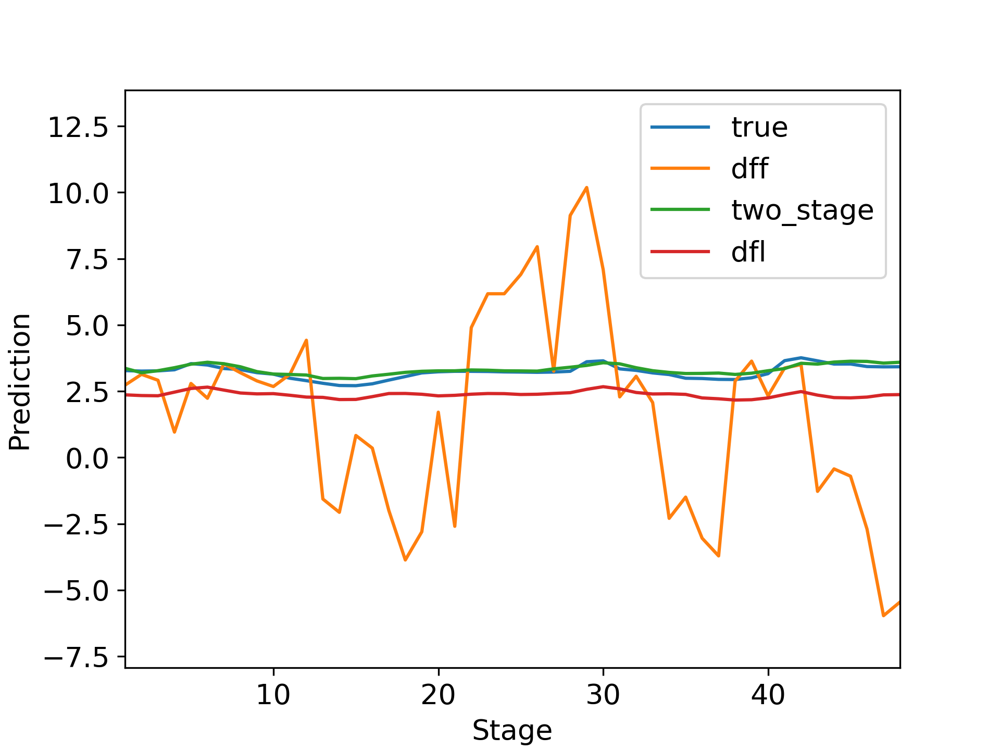

# Decision Focused Forecasting
This repository contains the code to replicate the experiment in the eponymous paper.

The data for the battery storage experiment (contained in *battery_storage/Data/battery_storage*) was copied from the [respository](https://github.com/locuslab/e2e-model-learning) associated with Donti et al. (2017). The original time series used to be published by [PJM](https://www.pjm.com/). We also borrow some of the data loading code in *data_utils.py*. The data for the portfolio optimisation experiment (contained in *portfolio_optimisation/Data/portfolio_optimisation/CNNpred*) was copied from [repository](https://github.com/hoseinzadeehsan/CNNpred-Keras).

|  |
|:--:|
| *Figure 1: Example model predictions on the battery storage task.* |

## Running 

The models are built with PyTorch and cvxpylayers, implementation is in *models.py*. We provide a *[requirements.py](requirements.txt)* file to clarify other dependencies. To try the experiment with diffferent hyperparameters the *hyperparameters.py* file contains a function in which settings may be changed. To run the experiment first cd into the desired experiment and call *run.py* in which one can define how many replications to run. The file runs the experiment function defined in *experiment_whole_policy_evaluation.py* which contains the whole pipeline as assembled from other files.

## Other files
- *Results/policy/* contains the results of the experiments that we ran (not including saved models due to size in the case of portfolito optimisation). 
- *data_utils.py* contains loading/processing functions for data and dataset classes for training and evaluation.
- *evaluation_utils.py* contains evaluation functions.
- *optimisation_utils.py* contains functions which parametrically build the cvxpy problem and optimisation layer, and the torch loss function for the DFF optimisation.
